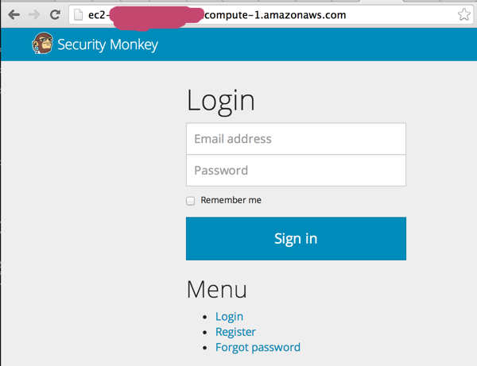
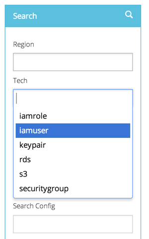
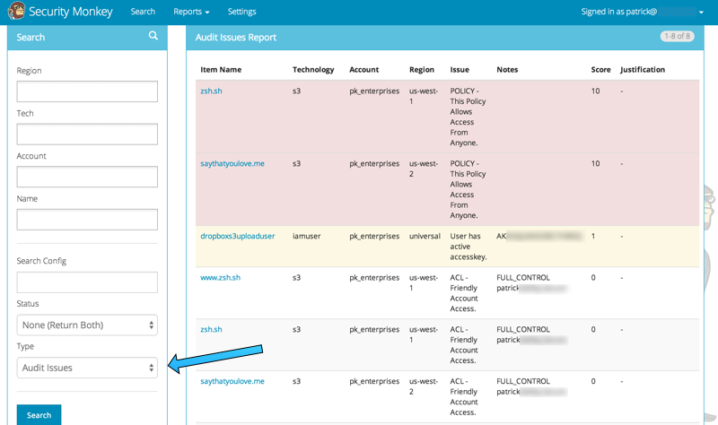
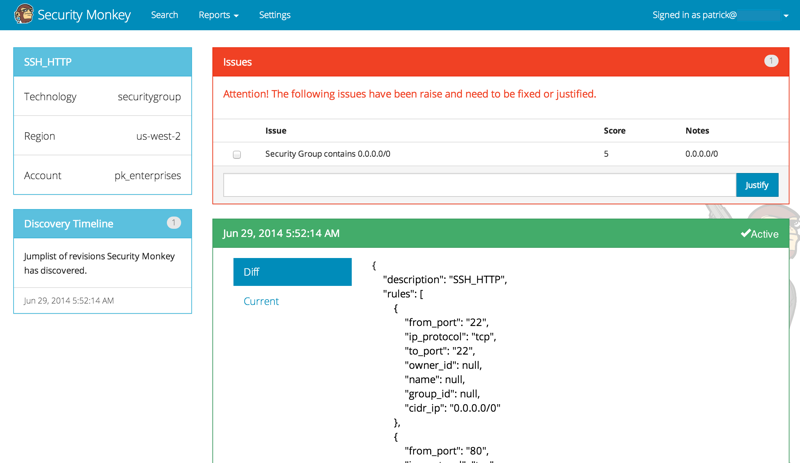
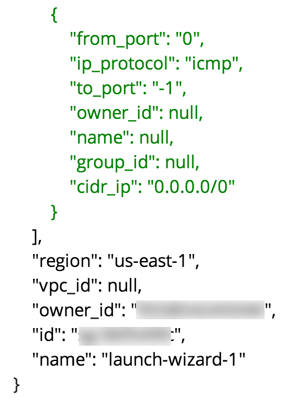
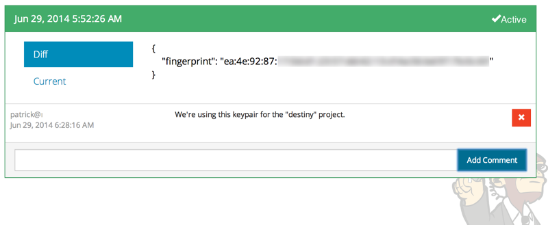
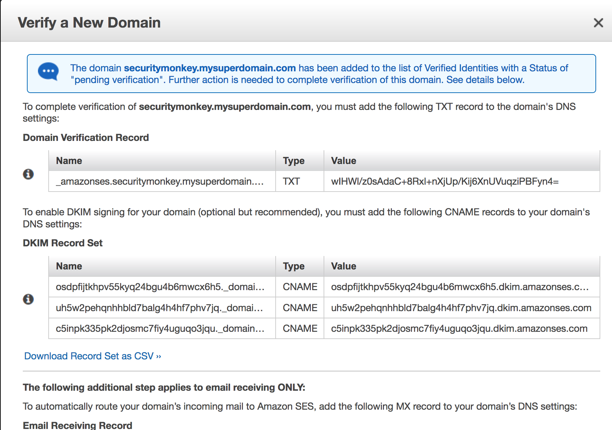
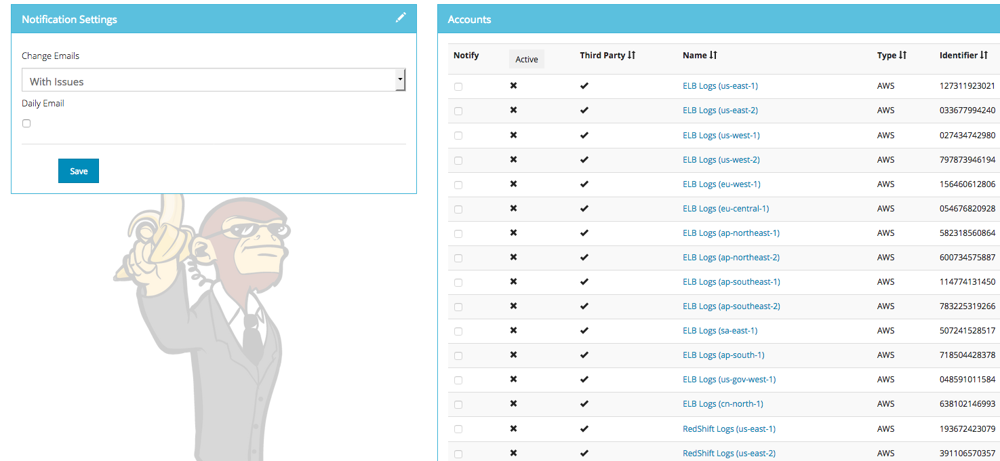

User Guide
==========

In this document, we outline the following:
1. Logging into the UI
1. Adding an account via the web UI
1. Autoscaling and fetching data
1. Searching the UI
1. Viewing and item in the UI
1. Receiving notification emails
1. Disabling auditor checks / overriding scores
1. Tuning the watchers / Prioritizing

Logging into the UI
===================

You should now be able to reach your server

After you have registered a new account and logged in, you need to add an account for Security Monkey to monitor. Click on "Settings" in the very top menu bar.

Adding an Account in the Web UI
-------------------------------

Here you will see a list of the accounts Security Monkey is monitoring.

Click on the plus sign to create a new account:

Now we will provide Security Monkey with information about the account you would like to monitor.

When creating a new account in Security Monkey, you may use any "Name" that you would like. Example names are 'prod', 'test', 'dev', or 'it'. Names should be unique.

The **S3 Name** has special meaning. This is the name used on S3 ACL policies. If you are unsure, it is probably the beginning of the email address that was used to create the AWS account. (If you signed up as <super_geek@example.com>, your s3 name is probably super\_geek.) You can edit this value at any time.

The **Number** is the AWS account number. This must be provided.

**Notes** is an optional field.

**Active** specifies whether Security Monkey should track policies and changes in this account. There are cases where you want Security Monkey to know about a friendly account, but don't want Security Monkey to track it's changes.

**Third Party** This is a way to tell security monkey that the account is friendly and not owned by you.

**Note: You will need to restart the scheduler running on the "scheduler" instance whenever you add a new account, disable an existing account, or modify a watcher configuration.** We plan to remove this requirement in the future.:

    $ sudo supervisorctl
    securitymonkeyscheduler          RUNNING    pid 11519, uptime 0:00:42
    supervisor> stop securitymonkeyscheduler
    securitymonkeyscheduler: stopped
    supervisor> start securitymonkeyscheduler
    securitymonkeyscheduler          RUNNING    pid 11520, uptime 0:00:01
    supervisor>

The first run will occur in 15 minutes. You can monitor all the log files in /var/log/security\_monkey/. In the browser, you can hit the `` `AutoRefresh ``\` button so the browser will attempt to load results every 30 seconds.

**Note: You can also add accounts via the command line with manage.py**:

    $ monkey add_account_aws --id 12345678910 --name account_foo
    Successfully added account account_foo

If an account with the same number already exists, this will do nothing, unless you pass `--force`, in which case, it will override the existing account:

    $ monkey add_account_aws --number 12345678910 --name account_foo
    An account with id 12345678910 already exists
    $ monkey add_account_aws --number 12345678910 --name account_foo --active false --force
    Successfully added account account_foo
    
🚨 Important 🚨 - Autostarting and Fetching Data
================================================
At this point Security Monkey is set to manually run. However, we need to ensure that it is always running and automatically
fetching data from your environment.

Please review the next section titled [Autostarting Security Monkey](autostarting.md) for details. Please note, this section
is very important and involved, so please pay close attention to the details.

Now What?
=========

Wow. We have accomplished a lot. Now we can use the Web UI to review our security posture.

Searching in the Web UI
-----------------------

On the Web UI, click the Search button at the top left. If the scheduler is setup correctly, we should now see items filling the table. These items are colored if they have issues. Yellow is for minor issues like friendly cross account access while red indicates more important security issues, like an S3 bucket granting access to "AllUsers" or a security group allowing 0.0.0.0/0. The newest results are always at the top.

We can filter these results using the searchbox on the left. The Region, Tech, Account, and Name fields use auto-complete to help you find what you need.

Security Monkey also provides you the ability to search only for issues:

Viewing an Item in the Web UI
-----------------------------

Clicking on an item in the web UI brings up the view-item page.

This item has an attached issue. Someone has left SSH open to the Internet! Security Monkey helps you find these types of insecure configurations and correct them.

If Security Monkey finds an issue that you aren't worried about, you should justify the issue and leave a message explaining to others why the configuration is okay.

Security Monkey looks for changes in configurations. When there is a change, it uses colors to show you the part of the configuration that was affected. Green tells you that a section was added while red says something has been removed.

Each revision to an item can have comments attached. These can explain why a change was made.

Receiving notification mails
-----------------------------

Security Monkey has a built-in mail notification system that can be used with SMTP or AWS SES. By default, SES is enabled but you can change that behaviour with the following variables : 

    # These are only required if using SMTP instead of SES
    EMAILS_USE_SMTP = False     # Otherwise, Use SES
    SES_REGION = 'us-east-1'
    MAIL_SERVER = 'smtp.example.com'
    MAIL_PORT = 465
    MAIL_USE_SSL = True
    MAIL_USERNAME = 'username'
    MAIL_PASSWORD = 'password'

If you want to use SMTP, change the EMAILS_USE_SMTP variable to True and modify the other MAIL_* Variables.

If you want to use the default settings and use SES, the variable that matters is SES_REGION. SES is one of these services  that aren't available in all the regions but it's ok, it can be in a different region than your instances. Here's how to setup SES. 

[See the list of the available regions for SES](http://docs.aws.amazon.com/ses/latest/DeveloperGuide/regions.html)

**Note: To set up SES with Security Monkey, you will need the following**

- A valid domain name for securitymonkey, not the one that is provided automatically by EC2 because it can change
- An elastic IP bound to this domain, for the same reasons
- An access to the DNS Services of that domain to add records that are required by Amazon to enable your domain to send mails

**SES**

Go to the SES section in the chosen region if yours doesn't support SES, this example will use the one from us-west-2

Here, you will want to add the domain that you use for securitymonkey, that will enable amazon to make sure that you own that domain. It is advised to also generate DKIM.

You will now be provided DNS records to add to your DNS. As DNS technologies varies, that documentation won't cover that part, you should see with your DNS provider to see it done if you can't do it yourself.

You should now see your domain in a **Pending** state, it will be so until amazon approves it. It could last up to 36h according to the official documentation, mine took a few hours. Once it's done, the original mail address used to create the AWS account will be notified by mail.

You will also need to verify the email addresses you want mails to be sent to. Amazon wants to make sure that you own the address before sending mails to it. You should receive a mail on that box immediately and just have to follow the link to verify it.

**SECURITY MONKEY CLI CONF**

In the **config.py** configuration file, make sure that the variable **SES_REGION** is set on the right AWS region, then you will need the variable **MAIL_DEFAULT_SENDER = 'mysuperaddress@domain.com'** to be set to your domain. the name is merely a preference here since it's just a mail sending

Save, make sure you are in the venv then restart the superviser to apply the changes
    sudo systemctl restart supervisor

**SECURITY MONKEY GUI CONF**

The elements to activate the mails are under the settings -> Accounts section :

- The **Notification Settings** panel
- The notify box ticked for the accounts you want these settings to be applied on the **Accounts** panel 

You should now see your settings in the **Settings -> Users** section

Once Amazon approves your domain, you will be able to receive mails.

**Note : There are two different settings for mail. the Daily Email will send you a recap of all the issues, the change emails will notify you when there is change in settings**

Disabling auditor checks / overriding scores
-----------------
If you want to ignore an audit issue, or want to change the scoring of it, you can do that by:

1. Go to Settings.
1. Go to the `Audit Issue Scores` tab.
1. On this page there will be a list of existing overrides. You can edit and delete the existing overrides here.
1. To add a new override, click on the `+` button.
1. Under `Technology`, select the technology that you would like to set.
1. For `Method`, select the specific auditor setting that you would like to modify.
1. If you want to disable the auditor, then check the `Disabled` box and click save.
1. If you want to change the default score for this item, select a score value in the `Score` drop-down list, and click Save.

Once you save, you will need to re-run the auditors for the changes to take affect. You can do this manually run hopping onto a security monkey instance, and while in the
activated virtual environment, run `monkey audit_changes -m TECHNOLOGYNAME`.

For example if you are not interested in egress security group rules for `0.0.0.0/0`, then you would want to override the auditor setting for that:

ADVANCED: Tuning the Watchers / Prioritizing
-------------------
Please see [this document here](tuneworkers.md).
